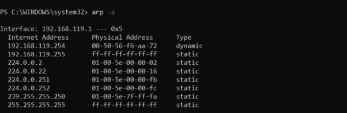
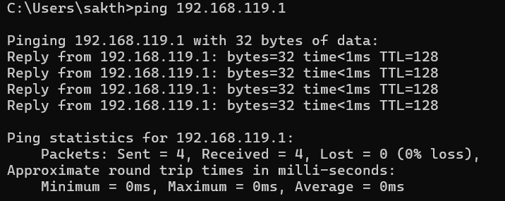
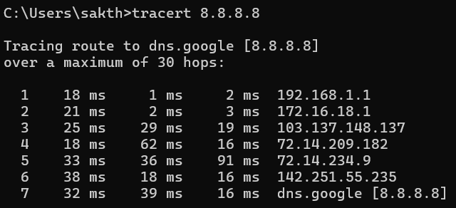

# 🛡️ Day 8 – VLAN, ARP, ICMP, Ping & Traceroute (Cybersecurity)

This document contains **refined, corrected, and structured notes** for **Day 8 of Cybersecurity learning**, combining theory with basic hands-on concepts.

Focus:

* VLANs
* ARP
* ICMP
* Ping & Traceroute

---

## 🔀 Virtual Local Area Network (VLAN)

A **VLAN (Virtual Local Area Network)** is a **logical partition of a physical LAN** at the **Data Link Layer**.

* Devices in the same VLAN form a **separate broadcast domain**
* VLANs share the same physical infrastructure but remain **logically isolated**
* Hosts are **unaware** of VLAN existence

---

### Benefits of VLANs

1. Improved security
2. Cost reduction
3. Better performance
4. Reduced broadcast traffic
5. Improved IT staff efficiency
6. Easier application and project management

---

### Types of VLANs

* **Data VLAN** – User-generated traffic
* **Default VLAN** – All switch ports initially belong here
* **Native VLAN** – Untagged traffic on trunk links
* **Management VLAN** – Used for device management
* **Voice VLAN** – Optimized for voice traffic

---

## 🏷️ VLAN Frame Tagging

**VLAN tagging** adds VLAN identification information to Ethernet frames.

### Key Points

* Used when frames travel over **trunk links**
* Switches add VLAN tags before sending frames through trunk ports
* Tags are removed before forwarding frames through access ports
* Enables frames to traverse multiple switches while staying in the correct VLAN

### Tagging Standard

* **IEEE 802.1Q** – Most widely used VLAN tagging protocol

---

## 🔁 Address Resolution Protocol (ARP)

**ARP** maps **IPv4 addresses** to **MAC addresses** within a local network.

### How ARP Works

* ARP request is broadcast in the LAN
* Device with matching IP responds with its MAC address
* Mapping is stored in the **ARP cache** for future use

---

### ARP Cache

* Stores known IP → MAC mappings
* Improves performance by reducing broadcasts

Command example:

```bash
arp -a
```

---

## 📡 Internet Control Message Protocol (ICMP)

**ICMP** is a **network-layer protocol** used to send:

* Error messages
* Diagnostic information

Used by devices like routers, gateways, and hosts.

---

## 🏓 Ping


**Ping** is a network troubleshooting tool that uses **ICMP Echo Request and Echo Reply** messages.

### Uses

* Checks host availability
* Measures round-trip time
* Helps diagnose connectivity issues

---

### Common Ping Errors

1. **Request timed out**

   * Target host is unreachable, offline, or blocking ICMP

2. **Destination host unreachable**

   * No route to the destination exists

3. **Ping could not find host**

   * DNS resolution failure

---

## 🧭 Traceroute


**Traceroute** displays the path packets take to reach a destination.

* Shows each hop along the route
* Measures delay between hops

### How Traceroute Works

* Uses **TTL (Time To Live)** values
* Each router decreases TTL by 1
* When TTL reaches 0, router sends ICMP message back

Command example:

```bash
traceroute google.com
```

---

## ⏳ TTL (Time To Live)

* Limits the lifespan of IP packets
* Prevents infinite routing loops
* Decremented at every hop

---

## ✅ Day 8 Summary

✔ Understood VLAN concepts and tagging
✔ Learned ARP and ARP cache usage
✔ Understood ICMP for diagnostics
✔ Practiced ping and traceroute commands

---

🧠 *VLANs isolate traffic, ARP resolves addresses, and ICMP helps troubleshoot the network.*
